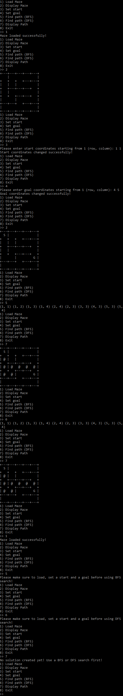

<div align="center">
    
  <h3 align="center">C++ Maze Solver</h3>
A C++ program that takes a maze file as an input and produces a solution using breadth-first search or depth-first search
<hr>

</div>


## :flight_departure: How To Run
#### Unix:
1. `git pull https://github.com/ElixirForge/maze-solver.git` (Must have git installed on your OS) -OR- download the zip file and extract it in the desired directory
2. Install g++ (Most likely preinstalled with MacOS or your Linux Distribution)
3. In project directory: `g++ *.cpp -o output`
4. In project directory: `./output`

#### Windows (Visual Studio):
1. Install [Visual Studio](https://visualstudio.microsoft.com)
2. Make sure to install the "Desktop development with C++" component
3. Launch Visual Studio. File --> New --> Project --> Win32 Console Application
4. Download the code as a zip file and copy the contents to the Visual Studio project directory's source files
5. Run using the local Windows debugger or press Ctrl+F5

## :question: How To Use:
#### 1. The program takes in a maze (`maze.txt`) as an input; a valid maze must exist in the same directory as the cpp files. I have provided `maze.txt` & `maze2.txt` as examples in the repository. Here are examples of valid maze.txt files and the solutions provided by the algorithm:
```
        maze.txt (Unsolved)
+---+---+---+---+---+---+---+---+
| S |                           |
+   +   +   +---+---+---+---+---+
|   |   |                       |
+   +---+---+---+   +---+---+---+
|   |                           |
+   +   +---+---+   +---+---+---+
|       |                       |
+---+---+   +---+---+---+---+---+
|                             G 
+---+---+---+---+---+---+---+---+			


        maze.txt (Unsolved)                                    BFS
+---+---+---+---+---+---+---+---+		+---+---+---+---+---+---+---+---+
| S                             |		| S   *   *   *   *   *   *   * |
+   +---+---+---+---+---+---+   +		+   +---+---+---+---+---+---+   +
|   |                           |		| @ | *   *   *   *   *   *   * |
+   +   +---+---+---+---+---+---+		+   +   +---+---+---+---+---+---+ 
|                               |		| @   @   @   @   @   @   @     |
+---+---+   +---+   +---+   +---+		+---+---+   +---+   +---+   +---+
|           |       |         G 		| *   *   * |       |     @   G 
+   +---+---+---+---+   +---+---+		+   +---+---+---+---+   +---+---+
|                               |		| *   *   *                     |
+---+---+---+---+---+---+---+---+		+---+---+---+---+---+---+---+---+

            DFS (#1)                                 DFS (#2 – same as above)
+---+---+---+---+---+---+---+---+		+---+---+---+---+---+---+---+---+
| S                             |		| S   @   @   @   @   @   @   @ |
+   +---+---+---+---+---+---+   +		+   +---+---+---+---+---+---+   +
| @ |                           |		|   | @   @   @   @   @   @   @ |
+   +   +---+---+---+---+---+---+		+   +   +---+---+---+---+---+---+
| @   @   @                     |		|     @   @   @   @   @   @   * |
+---+---+   +---+   +---+   +---+		+---+---+   +---+   +---+   +---+
| @   @   @ |       | @   @   G 		|           |       |     @   G 
+   +---+---+---+---+   +---+---+		+   +---+---+---+---+   +---+---+
| @   @   @   @   @   @   *   * |		|                               |
+---+---+---+---+---+---+---+---+		+---+---+---+---+---+---+---+---+

Legend:
S: Start
G: Goal
@: Indicates the cell is part of the path from start to goal
*: Indicates the cell has been visited, but is not part of the path from start to finish
```


#### 2. When the program runs, you are presented with a set of options:-
```
1) Load Maze 
2) Display Maze
3) Set start
4) Set goal
5) Find path (BFS)
6) Find path (DFS)
7) Display Path
8) Exit
```
1 -> First step which must always be done; reads the maze file  
2 -> Displays the loaded maze file on the console  
3 -> Set start or modify existing start. Once selected, type in coordinates of the desired cell --> `1 1` is top left for example 
4 -> Set goal or modify existing goal. Once selected, type in coordinates of the desired cell  
5 -> Attempts to solve the maze with breadth-first search. If successful, displays the path coordinates  
6 -> Attempts to solve the maze with depth-first search. If successful, displays the path coordinates  
7 -> Displays the solved maze (With @ and * symbols) 
8 -> Exits the program safely

#### 3. :rocket: :rocket: Play around with different options and maze files :D :rocket: :rocket:

## :beetle: Bugs
There is a prominent bug that causes a segmentation error. I would have to review the code since I've written it a while back, but as of right now, here is how to use the program without triggering the error:
1. Load the maze <i>(Option 1)</i> such that it looks like:
```
+---+---+---+---+---+
| S |               |
+   +   +   +---+---+
|   |   |           |
+   +---+---+---+   +
|   |               |
+   +   +---+---+   +
|       |           |
+---+---+   +---+---+
|                 G   
+---+---+---+---+---+
```
3. Modify the maze.txt (Add the border on the bottom right) file and save so that it looks like:
```
+---+---+---+---+---+
| S |               |
+   +   +   +---+---+
|   |   |           |
+   +---+---+---+   +
|   |               |
+   +   +---+---+   +
|       |           |
+---+---+   +---+---+
|                 G | 
+---+---+---+---+---+
```
4. Load the maze again <i>(Option 1)</i>
5. You can now use options 5, 6, 7. Options 3 & 4 seem to also be broken due to the same bug.

## :tv: Demo
<div align="center">

</div>
